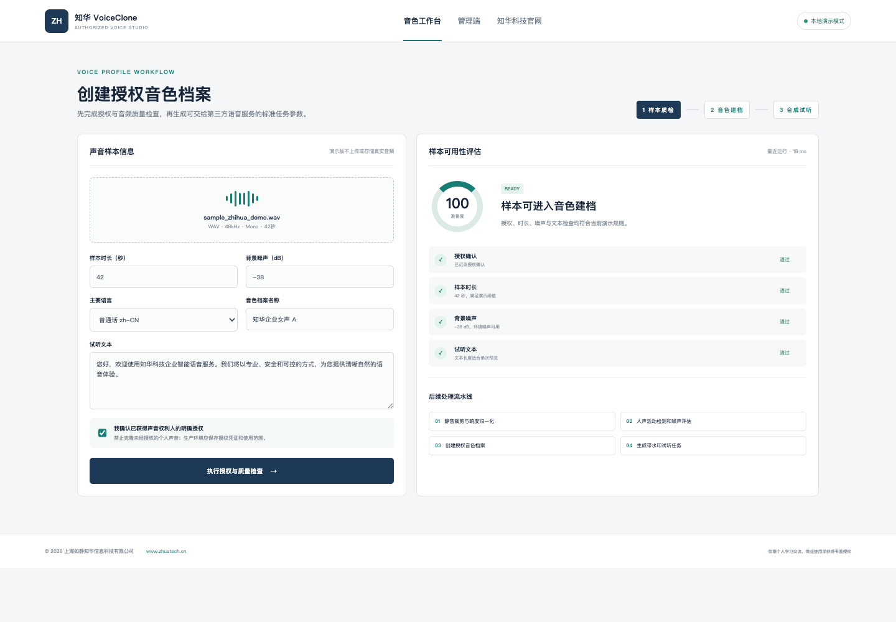

# ZhuaTech VoiceClone｜知华科技授权音色克隆工作台

[简体中文](README.md) | [English](README.en.md)

ZhuaTech VoiceClone 是上海如静知华信息科技有限公司推出的授权音色克隆案例项目，围绕声音授权、样本质量检查、音色档案和合成任务编排提供完整的前后端演示。

[知华科技官网](https://www.zhuatech.cn/) · Java 包名 `cn.zhuatech.voiceclone` · API `POST /api/voiceclone/analyze`

> 本项目不提供绕过授权的声音克隆能力，不内置第三方语音模型或密钥。默认本地规则可运行，使用者可在取得合法授权后自行接入合规的多模态语音服务。



## 可运行功能

- 声音权利人授权确认和阻断规则
- 样本时长、背景噪声和文本长度检查
- 音色档案与试听任务参数编排
- 默认开启试听水印的 Provider Payload
- 用户工作台和音色资产管理端
- Provider、Base URL、Model、API Key 环境变量接口
- Java 单元测试、Docker 和 MySQL 表结构

## 快速启动

后端：

```bash
cd backend
mvn spring-boot:run
```

前端可直接打开 `frontend/index.html`，或执行：

```bash
docker compose up --build
```

访问 `http://localhost:8088`。未启动后端时，页面自动使用相同逻辑的本地演示规则。

## 服务接入预留

```dotenv
ZHUATECH_AUDIO_PROVIDER=local
ZHUATECH_AUDIO_BASE_URL=
ZHUATECH_AUDIO_MODEL=voice-clone-provider-model
ZHUATECH_AUDIO_API_KEY=
```

使用者需要自行选择具备授权、隐私与内容安全能力的语音服务，并实现真实音频上传、加密存储、删除、授权撤回、生成水印和审计。

## 安全边界

- 不得克隆未经本人或合法权利人明确授权的声音。
- 不得用于冒充、诈骗、虚假客服、伪造证据或误导公众。
- 生产系统应保存授权材料、使用范围、有效期和撤回记录。
- 面向外部发布的合成音频应增加可识别标记或数字水印。

## 使用许可与咨询

本工程仅限个人学习、研究和非商业技术交流，**不得商用**。商业部署、品牌替换、模型接入、软件项目外包和深度定制须获得上海如静知华信息科技有限公司书面授权，详见 [LICENSE](LICENSE)。

| 微信咨询一 | 微信咨询二 |
| --- | --- |
|  |  |

SEO：AI 音色克隆源码、声音克隆系统、授权语音合成、Java 音频 AI、企业语音平台、音色管理、DeepSeek 多模态预留、知华科技。
